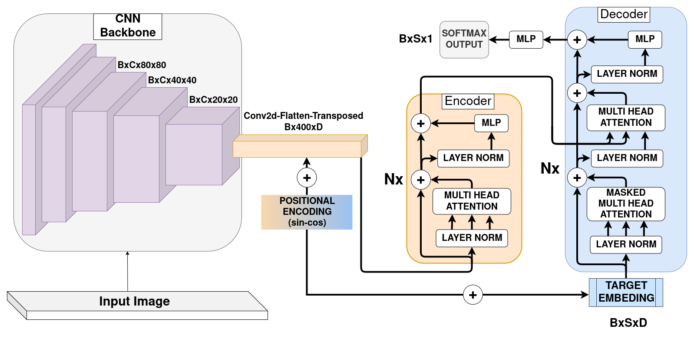

# Image Caption with Transformer

This repostory presents to define and train your image captioning models with [Ultralytics]() models backbone (or image patching which does not include backbone) and Transformer Encoder-Decoder architecture. 

## Architecure

    Image --> CNNBackbone --> Encoder --> Decoder



Main idea is that a image flows trought a Ultralytics model backbone (such as YOLO, RTDETR) and its output (shaped like [B,C,20,20]) converts into logical visual tokens (shaped like [B,400,C]). After, this visual tokens turns to word tokens regulerly by attention with Encoder-Decoder Transformer Architecture.

## Installation
```bash
git clone https://github.com/mevlt01001/IMG-Captioning.git

cd IMG-Captioning

pip install -r requirements.txt
```

## Usage

```python
from ultralytics import YOLO
from modules.model import Model
from modules.tokenizer import Tokenizer

images_paths = ["root/img1.png", "root/img2.png"...]
captions = ["Image features a huge building", ...]
tokenizer = Tokenizer(captions)
yolo11n = YOLO("yolo11n.pt")

# Model initialization
model = Model(
    tokenizer=tokenizer,
    model=yolo11n, # Backbone
    imgsz=640, # Input Image Size
    dim=512, # Token embedding dimension
    encoder_depth=2,
    decoder_depth=2,
    encoder_num_heads=2,
    decoder_num_heads=2,
    device=device,
)

# Training
model.train(
    imagepaths=images_paths,
    epoch=100, 
    batch_size=64,
    lr=5e-4,
    save_dir="train_outs",
)

# Model from checkpoint
model = Model.load_from_checkpoint(
    path="train_outs/best.pt", 
    tokenizer=tokenizer,
    device=device)

# Predicting 
model.predict("dog_bike_car.jpg")
```

